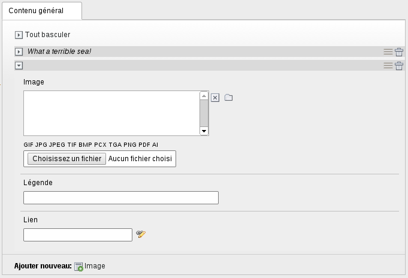

.. ==================================================
.. FOR YOUR INFORMATION
.. --------------------------------------------------
.. -*- coding: utf-8 -*- with BOM.

.. include:: ../Includes.txt

.. _developer-manual:

Developer Manual
================

This chapter describes some hooks which provide you an easy way to use flexform's session in typoscript and an introduction to the gridelements_fce generator.

Assets
------
Sometimes you need to attach assets to your FCE and it could be great to use these assets only when the FCE is used. You now have new cObject for that.

.. ..................................
.. container:: table-row

  Property
    HEADER_DATA

  Data type
    ->CARRAY

  Description
    Same as `headerData page's function
    <http://docs.typo3.org/typo3cms/TyposcriptReference/Setup/Page/Index.html#headerdata>`_

    **Example**
    ::

        1 = HEADER_DATA
        1.value = <link rel="stylesheet" type="text/css" href="typo3conf/ext/skinFlex/Resources/Public/css/test.css" media="all">

.. ..................................
.. container:: table-row

  Property
    INCLUDE_CSS

  Data type
    resource

  Description
    Same as `includeCSS page's function
    <http://docs.typo3.org/typo3cms/TyposcriptReference/Setup/Page/Index.html#includecss-array>`_

    **Example**
    ::

        1 = INCLUDE_CSS
        1.test = EXT:skinFlex/Resources/Public/css/test.css

.. ..................................
.. container:: table-row

  Property
    CSS_INLINE

  Data type
    ->CARRAY

  Description
    Same as `cssInline page's function
    <http://docs.typo3.org/typo3cms/TyposcriptReference/Setup/Page/Index.html#cssinline>`_

    **Example**
    ::

        1 = CSS_INLINE
        1{
          10 = TEXT
          10.value = body { background-color: red; }
        }

.. ..................................
.. container:: table-row

  Property
    INCLUDE_JS

  Data type
    resource

  Description
    Same as `includeJS page's function
    <http://docs.typo3.org/typo3cms/TyposcriptReference/Setup/Page/Index.html#includejs-array>`_

    **Example**
    ::

        1 = INCLUDE_JS
        1.test = EXT:skinFlex/Resources/Public/js/test.js

.. ..................................
.. container:: table-row

  Property
    INCLUDE_JS_FOOTER

  Data type
    resource

  Description
    Same as `includeJS page's function
    <http://docs.typo3.org/typo3cms/TyposcriptReference/Setup/Page/Index.html#includejsfooter-array>`_

    **Example**
    ::

        1 = INCLUDE_JS_FOOTER
        1.test = EXT:skinFlex/Resources/Public/js/test.js

Section
-------

Sometimes in FCE, it's convenient to loop on some items, in a slideshow for example.

In flexform, it looks like this::

    <el>
      <images>
        <section>1</section>
        <type>array</type>
        <el>
          <image>
            <type>array</type>
            <tx_templavoila>
              <title>LLL:EXT:skinFlex/Resources/Private/Language/slideshow.xlf:flexform.slideshow.image</title>
            </tx_templavoila>
            <el>
              <file>
                <TCEforms>
                  <label>LLL:EXT:skinFlex/Resources/Private/Language/slideshow.xlf:flexform.slideshow.image</label>
                  <config>
                    <type>group</type>
                    <internal_type>file</internal_type>
                    <allowed>gif,jpg,jpeg,tif,bmp,pcx,tga,png,pdf,ai</allowed>
                    <max_size>5000</max_size>
                    <uploadfolder>uploads/skinFlex/slideshow/</uploadfolder>
                    <show_thumbs>1</show_thumbs>
                    <maxitems>1</maxitems>
                  </config>
                </TCEforms>
              </file>
              <caption>
                <TCEforms>
                  <label>LLL:EXT:skinFlex/Resources/Private/Language/slideshow.xlf:flexform.slideshow.caption</label>
                  <config>
                    <type>input</type>
                  </config>
                </TCEforms>
              </caption>
            </el>
          </image>
        </el>
      </images>
    </el>

Use this kind of configuration in typoscript may be difficult. You can use `XPATH Content Object <http://typo3.org/extensions/repository/view/cobj_xpath>`_ but this extension provide a way based on brilliant `wec_contentelements <http://typo3.org/extensions/repository/view/wec_contentelements>`_ extension.

You now have new typoscript objects to declare and make loop on section ::

    10 = FLEXFORM_SECTION

and new get datas objects **section** and **section_item** ::

    rootPath = section:images/el              # to define the loop root path
    ...
    data = section_item:image/el/caption      # access to a field in the loop

And that's it! To complete our previous example about slideshow, it could look like this ::

    tt_content.gridelements_pi1.20.10.setup.slideshow {
      prepend = COA
      prepend {
        1 = COA
        1 {
          10 = INCLUDE_CSS
          10.slideshow = EXT:skinFlex/Resources/Public/css/slideshow.css

          20 = INCLUDE_JS_FOOTER
          20.slideshow = EXT:skinFlex/Resources/Public/js/slideshow.js
        }

        5 = < lib.stdheader

        10 = FLEXFORM_SECTION
        10 {
          rootPath = section:images/el

          10 = COA
          10 {
            wrap = 
|

            10 = IMAGE
            10{
              file.import.data = section_item:image/el/file
              file.import.wrap = uploads/skinFlex/slideshow/
            }

            20 = TEXT
            20{
              data = section_item:image/el/caption
              required = 1
              wrap = 
|

            }
          }
        }
      }

      outerWrap = 
|

    }

Yeoman Generator
----------------
`Yeoman <http://yeoman.io/>`_ is a powerfull way to kickstart website, framework, ... In general, it's used for Javascript based code, but you can easily use it for you own purpose. That's why we've made a `grid-fce generator <https://github.com/Inouit/generator-grid-fce>`_. In this state, the generator already saves a lot of time in creating FCE but we still have some improvement in development. Feel free to make some feedback.